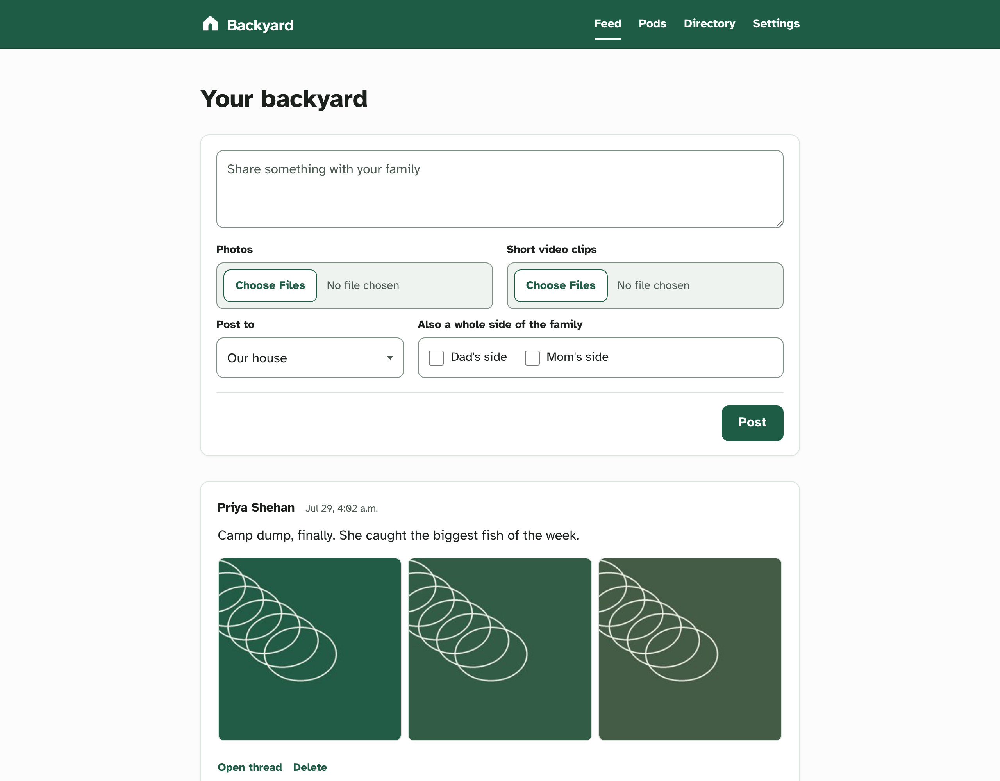
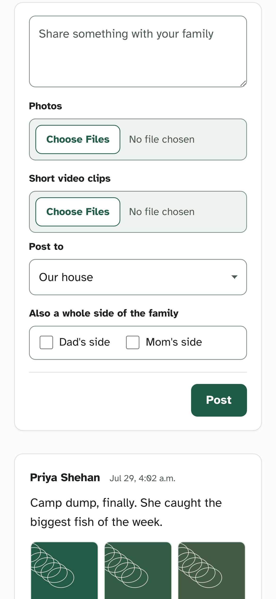
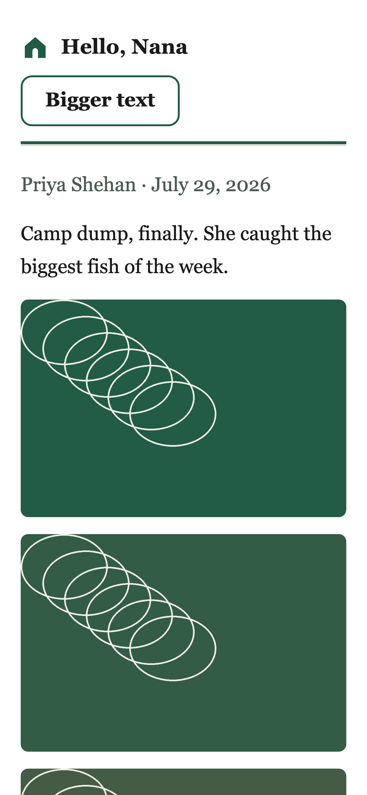

# Backyard

**A private, self-hosted social network for your extended family.** Each household gets a pod. Each side of the family shares a backyard.

> Status: **pre-release, July 2026.** It runs, and it is not shared with anyone yet. The
> author's own family gets it first, after he has manually QA'd it end to end. Built in
> public, decisions first, code second — the honest ledger of what is and is not done
> lives in [PATH-TO-100.md](docs/PATH-TO-100.md) and the
> [self-audit](docs/audits/2026-07-26-honest-100-audit.md), which is deliberately unkind
> to this project.

**[→ Install it](docs/runbooks/self-host.md)** — one `docker compose` command on a fresh
Linux box, with TLS. Read the honest limitations there first, especially about email.



<table>
<tr>
<td width="50%"></td>
<td width="50%"></td>
</tr>
<tr>
<td><b>The feed on a phone.</b> Chronological, and it ends.</td>
<td><b>The elder path.</b> One tapped link, no account, no app store. The token is exchanged for a cookie and drops out of the address bar on the first request.</td>
</tr>
</table>

*The images in that post are the demo family's generated fixtures, not photographs — no real
family content appears anywhere in this repository, and [that rule has no exceptions](CONTRIBUTING.md#privacy-line).*

## Install

```bash
git clone --branch v0.1.0 https://github.com/AIJSAI/backyard.git && cd backyard
cp .env.example .env        # then set the three POSTGRES_* passwords
docker compose -f docker-compose.yml -f docker-compose.prod.yml up -d --build
```

**Clone the tag, not `main`.** `main` changes daily and may be mid-refactor when you arrive;
a tag is a point someone deliberately stopped at with a green gate behind it. What is in
this one, and what is still missing, is in [CHANGELOG.md](CHANGELOG.md).

Open your domain, and the first-run screen makes you the instance admin. The full guide —
DNS, TLS, email, backups, upgrades, and what genuinely does not work yet — is
**[docs/runbooks/self-host.md](docs/runbooks/self-host.md)**.

> **Before you put your own family on it:** reply-by-email needs one manual step with your
> mail provider or replies are accepted and silently dropped, and nobody outside this
> project has security-reviewed it. Both are stated plainly in the changelog.

## Why this exists

It started with late-night texts. I kept finding things my family would love at 1am, and the options were "wake them up" or "forget it by morning." Group chats are interruptions. Big platforms treat your family as a growth channel. And I couldn't find a calm, private place where a family just posts things and everyone catches up whenever they want; the closest attempts are in the [OSS landscape](docs/research/2026-07-19-github-oss-landscape.md).

Then a family wedding made the second problem obvious: past your own household, you quietly lose track of everyone. Cousins grow up and nobody hears the small stuff.

Backyard is for both problems: an async feed for your household, and ambient awareness across the whole extended family.

## What it does

- A calm feed of links, photos, video and short updates. Chronological. It ends.
- **Pods and yards**: every household is a pod; each branch of the family is a yard with its own shared **backyard**. A household can belong to more than one yard, and nothing forces the sides together. Cross-yard access answers a 404 that is byte-identical to "no such thing", so it leaks not even existence.
- An elder path that requires no account and no app store: tap a link and you're in, in large single-column type, and photos and video work there too. Replying to the email digest opens the app at the thread. (Yes, a link that just works is a link that can be forwarded — that trade-off is argued out in [ADR-003](docs/adr/ADR-003-token-links.md).)
- Installable PWA (iPhone and Android, no gatekeepers), with an email digest in and out.
- Profiles that double as the family directory: the names the kids actually use, birthdays as month-and-day with no year and no age, contact fields whose visibility you set one by one, and a vCard download so the numbers in your phone stop being stale.
- Admin a non-technical person can hold: five documented roles with the permissions written beside the control, household invites, removal that asks what happens to their posts, and break-glass recovery.
- Export everything you authored, whenever, ungated. Encrypted backups, a restore that cannot resurrect a removed member's credentials, and a weekly health email that tells you when the backup stopped running.
- A self-host deploy on your own server, one `docker compose` command. Bring your own mail provider; email in and out is the hard part, and [the docs say so plainly](docs/runbooks/self-host.md).

**What is not done** is in [CHANGELOG.md](CHANGELOG.md) — including the one manual step that
reply-by-email needs, and the fact that nobody outside this project has security-reviewed it.

## What it will never be

- No ads, no tracking, no engagement mechanics. No streaks, no like counts, no read receipts.
- Nothing is amplified. No algorithm decides what your family sees.
- No speech rules baked into the software. Families govern themselves; we ship rooms, not referees.
- No lock-in. Export everything, always.

Full list: [product principles](docs/principles.md) — ratified, and written so each one is
concrete enough to be violated.

## Receipts

This project runs on evidence, in public:

- [Research brief](docs/research/2026-07-19-research-brief.md): the market gap and the peer-reviewed deployment studies behind the design requirements.
- [OSS landscape](docs/research/2026-07-19-github-oss-landscape.md): what exists, what died, and why.
- [Decision records](docs/adr/): the six load-bearing calls — [license](docs/adr/ADR-000-license.md), [name](docs/adr/ADR-001-name.md), [stack](docs/adr/ADR-002-stack.md), [forwardable token links](docs/adr/ADR-003-token-links.md), [deferring Postgres RLS](docs/adr/ADR-004-rls.md), [the batched policy defaults](docs/adr/ADR-005-batched-defaults.md).
- [Threat model](docs/security/threat-model.md): the adversaries, and every row's honest residual risk. Self-authored, un-reviewed by anyone else — which is itself a stated limitation.
- [Path to 100%](docs/PATH-TO-100.md): the definition of done. A box only gets checked with an evidence link, and CI enforces it. Two boxes carry corrections where their own evidence had rotted.
- [Build receipts](docs/receipts/): the running record — forty of them, including the bugs found while verifying the fix for the previous bug.

New here? **[docs/README.md](docs/README.md)** is the map.

## License

[AGPL-3.0](LICENSE). Rationale in [ADR-000](docs/adr/ADR-000-license.md). Contributions require a DCO sign-off; see [CONTRIBUTING](CONTRIBUTING.md).

Third-party material redistributed here — currently the Atkinson Hyperlegible font, under
the SIL Open Font License — is inventoried in [NOTICE.md](NOTICE.md).
