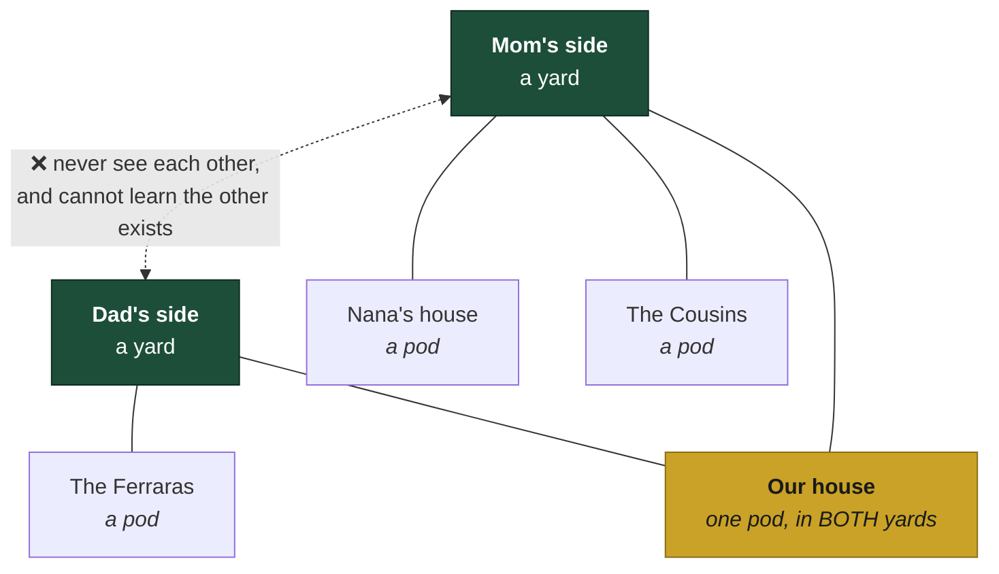
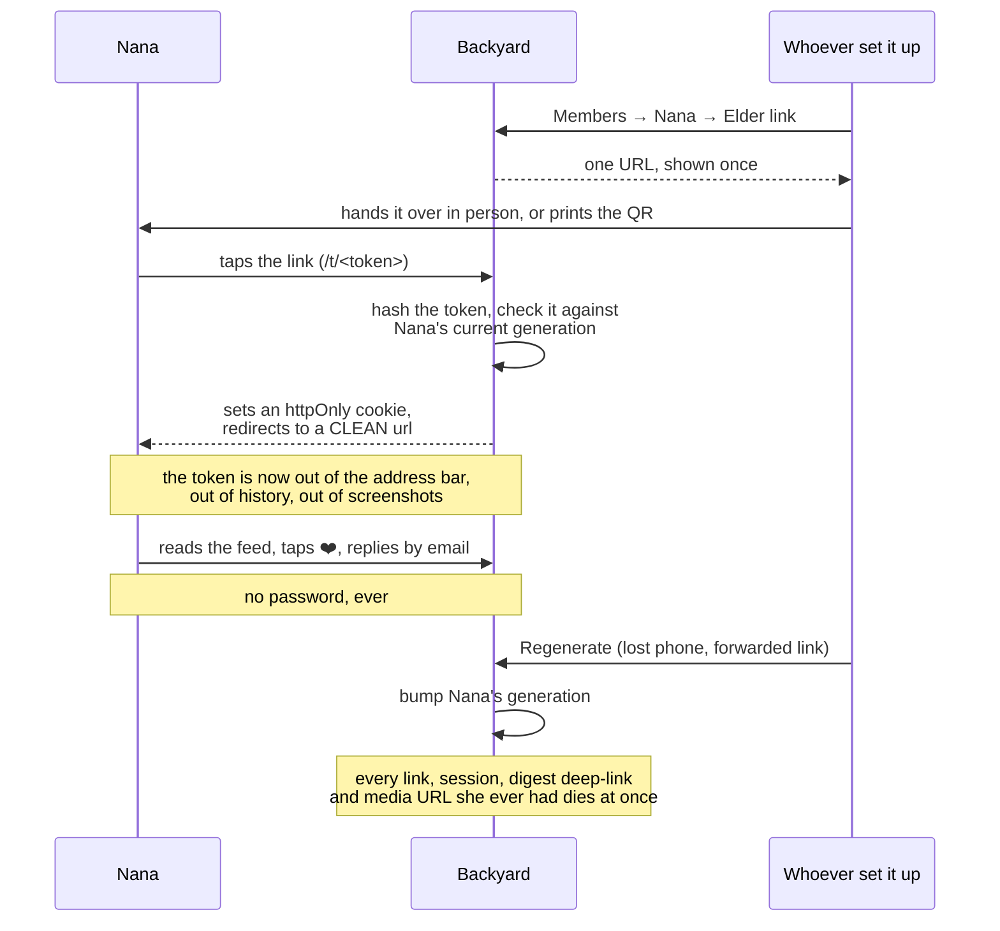
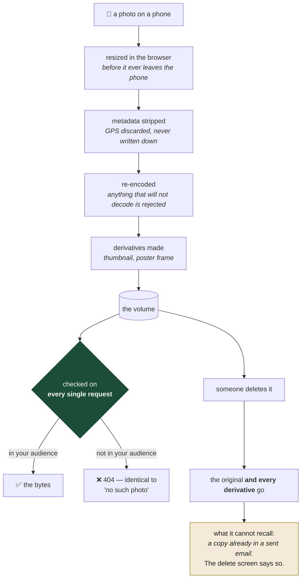
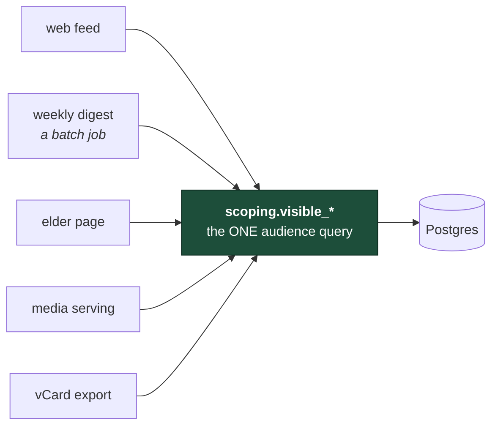

# Backyard docs

Ninety-odd files live under `docs/`, and most of them are a **working record** rather than
documentation. This page exists so you do not have to guess which is which.

Three doors:

| If you want to… | Start here |
|---|---|
| **run it** | [self-host.md](runbooks/self-host.md) → [backup-restore.md](runbooks/backup-restore.md) → [handover.md](runbooks/handover.md) |
| **understand why it is built this way** | the four pictures below, then [principles.md](principles.md), [ADRs](adr/), [threat-model.md](security/threat-model.md) |
| **see how it was actually built** | [PATH-TO-100.md](PATH-TO-100.md), [receipts/](receipts/), [audits/](audits/) |

---

## The four pictures

### 1. Pods and yards — the whole data model

This is the one idea you have to hold. Everything else follows from it.

- A **pod** is a household. A **yard** is one side of the family.
- A household in both yards (yours, probably) posts to either side, or to just its own pod.
- **The sides never fuse.** A member of Dad's side cannot see Mom's side, cannot enumerate it,
  and cannot tell a "not yours" 404 from a "does not exist" 404. That is one query,
  `scoping.visible_posts`, and every surface goes through it — feed, search, digest, media,
  the elder page. One implementation, so there is no second one to drift.

### 2. How a grandparent gets in without an account

The most-questioned design decision in the project. She taps one link. There is no password,
no app store, and nothing to install.

The honest trade-off: **a link that just works is a link that can be forwarded.** That is
argued out and accepted in [ADR-003](adr/ADR-003-token-links.md), and the counterweight is
that one click kills everything derived from it.

### 3. What happens to a photograph

Most of this exists because the photos are of children.

- **GPS is stripped at ingest and never written down** — a trade of archive fidelity for
  safety, made deliberately.
- Every byte, including thumbnails and poster frames, goes through **one** access-checked path.
  A static route that skipped it would be the whole hole, which is why the isolation suite
  enumerates asset types.
- Delete removes derivatives too. What it cannot recall is a copy already sitting in a sent
  email, and [the delete screen says so](security/threat-model.md) rather than implying otherwise.

### 4. One audience query, five surfaces

The structural rule that keeps the promise above true.

A batch job that reimplemented "who may see this" would drift from the feed within a month,
and email has no recall, no access log and no 404. So the digest builder consumes the same
code path as the web feed, per recipient, evaluated at send time — deleted posts, narrowed
audiences and removed members never ship. The vCard export was the newest surface to be wired
in, and it takes an already-filtered object rather than a database row, so it *cannot* reach a
field the viewer is not scoped for.

---

## Everything else, by kind

**Runbooks — operating a real instance**
[self-host](runbooks/self-host.md) · [backup-restore](runbooks/backup-restore.md) ·
[the succession sheet](runbooks/backup-recovery-sheet.md) · [handover](runbooks/handover.md) ·
[shutdown](runbooks/shutdown.md) · [setting up your side](runbooks/setting-up-your-side.md) ·
[founder QA script](runbooks/founder-qa.md) · [live repro](runbooks/live-repro.md) ·
[transcode measurement](runbooks/measure-transcode.md)

**Decisions** — [ADR-000 … ADR-005](adr/), plus
[the permission matrix](security/permission-matrix.md) and
[the threat model](security/threat-model.md).

**Product** — [PR-FAQ](PR-FAQ.md) · [principles](principles.md) ·
[metrics](metrics.md) · [assumptions and their kill criteria](assumptions.md) ·
[story map](story-map.md) · [the family privacy note](family-privacy-note.md)

**The working record** — [PATH-TO-100](PATH-TO-100.md) (the definition of done; a box needs an
evidence link and CI enforces it) · [receipts](receipts/) · [audits](audits/) ·
[research](research/) · [design](design/) · [retro](retro/) · [wave plan](wave-plan.md)

**Internal** — [RESUME-HERE](RESUME-HERE.md) is a handoff note for whoever picks the work up
next, not documentation. It is in the open because the project is built in the open.
